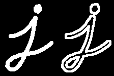

# 目标

在本教程中：

* 我们将学习不同的形态操作，如腐蚀、扩张、开、闭等。
* 我们将看到不同的函数，如： **[cv.erode()](https://docs.opencv.org/4.0.0/d4/d86/group__imgproc__filter.html#gaeb1e0c1033e3f6b891a25d0511362aeb)**、 **[cv.dilate()](https://docs.opencv.org/4.0.0/d4/d86/group__imgproc__filter.html#ga4ff0f3318642c4f469d0e11f242f3b6c)**、 **[cv.morphologyEx()](https://docs.opencv.org/4.0.0/d4/d86/group__imgproc__filter.html#ga67493776e3ad1a3df63883829375201f)**等。

## 理论

形态转换是基于图像形状的一些简单操作。它通常在二进制图像上执行。它需要两个输入，一个是我们的原始图像，第二个是决定操作性质的结构元素或内核。两个基本的形态学操作是腐蚀和扩张。接下来如开，闭，梯度等也会介绍。在下图的帮助下，我们将逐一看到它们：


### 1、腐蚀

侵蚀的基本概念就像土壤侵蚀一样，只侵蚀前景对象的边界（总是尽量保持前景为白色）。那它有什么作用呢？内核在图像中滑动（如二维卷积）。只有当内核下的所有像素都为 1 时，原始图像中的像素（1 或 0）才会被视为 1，否则会被侵蚀（变为零）。

所以根据内核的大小，边界附近的所有像素都将被丢弃。因此，前景对象的厚度或大小在图像中减少或只是白色区域减少。它有助于消除小的白色噪音（如我们在“颜色空间”一章中所看到的），分离两个连接的对象等。

作为一个例子，我将使用一个 5x5 内核，里面有很多内核。让我们看看它是如何工作的：

```python
mport cv2 as cv
import numpy as np
from matplotlib import pyplot as plt
img = cv.imread('opencv-logo-white.png')
blur = cv.blur(img,(5,5))
plt.subplot(121),plt.imshow(img),plt.title('Original')
plt.xticks([]), plt.yticks([])
plt.subplot(122),plt.imshow(blur),plt.title('Blurred')
plt.xticks([]), plt.yticks([])
plt.show()
```

结果：


### 2、扩张

它与侵蚀正好相反。这里，如果内核下至少有一个像素为“1”，则像素元素为“1”。所以它会增加图像中的白色区域，或者增加前景对象的大小。通常情况下，在去除噪音的情况下，腐蚀后会膨胀。因为，腐蚀消除了白噪声，但它也缩小了我们的对象。所以我们扩大它。由于噪音消失了，它们不会再回来，但我们的目标区域会增加。它还可用于连接对象的断开部分。

```python
dilation = cv.dilate(img,kernel,iterations = 1)
```

结果:


### 3、开

开只是腐蚀的另一个名称，随后是膨胀。正如我们上面所解释的，它对消除噪音很有用。在这里，我们使用 **[cv.morphologyEx()](https://docs.opencv.org/4.0.0/d4/d86/group__imgproc__filter.html#ga67493776e3ad1a3df63883829375201f)**。


```python
opening = cv.morphologyEx(img, cv.MORPH_OPEN, kernel)
```

结果:


### 4、闭

关闭与打开相反，膨胀后腐蚀。它在关闭前景对象内的小孔或对象上的小黑点时很有用。

```python
closing = cv.morphologyEx(img, cv.MORPH_CLOSE, kernel)
```

结果:


### 5、形态梯度

它与图像的膨胀和腐蚀相反。

结果将类似于对象的轮廓。

```python
gradient = cv.morphologyEx(img, cv.MORPH_GRADIENT, kernel)
```

结果:



### 6、顶帽

它与原图像和原图像的开相反。下面是 9*9 核的例子。

```python
tophat = cv.morphologyEx(img, cv.MORPH_TOPHAT, kernel)
```

结果:


### 7、黑帽

它与原图像和原图像的闭相反。

```python
blackhat = cv.morphologyEx(img, cv.MORPH_BLACKHAT, kernel)
```

结果:


## 结构参量

在前面的例子中，我们在 numpy 的帮助下手工创建了一个结构参量。它是长方形的。但在某些情况下，您可能需要椭圆/圆形的内核。因此，opencv 有一个函数，**[cv.getStructuringElement()](https://docs.opencv.org/4.0.0/d4/d86/group__imgproc__filter.html#gac342a1bb6eabf6f55c803b09268e36dc)**。只要传递内核的形状和大小，就可以得到所需的内核。

```python
# Rectangular Kernel
>>> cv.getStructuringElement(cv.MORPH_RECT,(5,5))
array([[1, 1, 1, 1, 1],
       [1, 1, 1, 1, 1],
       [1, 1, 1, 1, 1],
       [1, 1, 1, 1, 1],
       [1, 1, 1, 1, 1]], dtype=uint8)
# Elliptical Kernel
>>> cv.getStructuringElement(cv.MORPH_ELLIPSE,(5,5))
array([[0, 0, 1, 0, 0],
       [1, 1, 1, 1, 1],
       [1, 1, 1, 1, 1],
       [1, 1, 1, 1, 1],
       [0, 0, 1, 0, 0]], dtype=uint8)
# Cross-shaped Kernel
>>> cv.getStructuringElement(cv.MORPH_CROSS,(5,5))
array([[0, 0, 1, 0, 0],
       [0, 0, 1, 0, 0],
       [1, 1, 1, 1, 1],
       [0, 0, 1, 0, 0],
       [0, 0, 1, 0, 0]], dtype=uint8)
```

## 其他资源

在 HIPR2 的 **[形态学操作](http://homepages.inf.ed.ac.uk/rbf/HIPR2/morops.htm)**

## 练习
