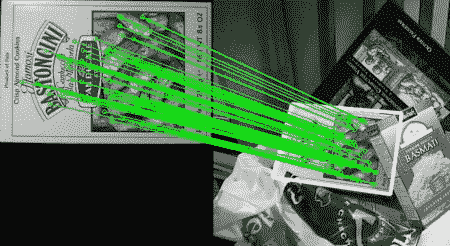

# 特征匹配+单应性查找对象

## 目标

在这一章当中，

- 我们将联合使用来自calib3d模块的特征匹配和findHomography来查找复杂图像中的已知对象。

## 基础

那我们上一节做了什么？我们使用了一个queryImage，在其中找到了一些特征点，我们采用了另一个trainImage，找到了该图像中的特征，最后找到它们之间特征点的最佳匹配。简而言之，我们在另一个杂乱的图像中找到了一个对象的某些部分的位置。这些信息足以在trainImage上准确找到对象。

为此，我们可以使用来自calib3d模块的函数，即 **[cv.findHomography()](https://docs.opencv.org/4.0.0/d9/d0c/group__calib3d.html#ga4abc2ece9fab9398f2e560d53c8c9780)** 。如果将两个图像中的特征点集传递给这个函数，它将找到该对象的透视变换。然后我们可以使用 **[cv.perspectiveTransform()](https://docs.opencv.org/4.0.0/d2/de8/group__core__array.html#gad327659ac03e5fd6894b90025e6900a7)** 来查找对象。它需要至少四个正确的点来找到这种变换。

我们已经看到匹配时可能存在一些可能的错误，这可能会影响结果。为了解决这个问题，算法使用RANSAC或LEAST_MEDIAN（可以由标志位决定）。因此，提供正确估计的良好匹配称为内点，剩余称为外点。 **[cv.findHomography()](https://docs.opencv.org/4.0.0/d9/d0c/group__calib3d.html#ga4abc2ece9fab9398f2e560d53c8c9780)** 返回一个指定了内点和外点的掩模。

那就让我们做吧！

## 代码

首先，像往常一样，让我们在图像中找到SIFT特征并应用比率测试来找到最佳匹配。

```python
import numpy as np
import cv2 as cv
from matplotlib import pyplot as plt
MIN_MATCH_COUNT = 10
img1 = cv.imread('box.png',0)          # queryImage
img2 = cv.imread('box_in_scene.png',0) # trainImage
# Initiate SIFT detector
sift = cv.xfeatures2d.SIFT_create()
# find the keypoints and descriptors with SIFT
kp1, des1 = sift.detectAndCompute(img1,None)
kp2, des2 = sift.detectAndCompute(img2,None)
FLANN_INDEX_KDTREE = 1
index_params = dict(algorithm = FLANN_INDEX_KDTREE, trees = 5)
search_params = dict(checks = 50)
flann = cv.FlannBasedMatcher(index_params, search_params)
matches = flann.knnMatch(des1,des2,k=2)
# store all the good matches as per Lowe's ratio test.
good = []
for m,n in matches:
    if m.distance < 0.7*n.distance:
        good.append(m)
```

现在我们设置一个条件，即至少10个匹配（由MIN_MATCH_COUNT定义）时才查找目标对象。否则只显示一条消息，说明没有足够的匹配。

如果找到足够的匹配，我们将提取两个图像中匹配的特征点的位置。他们被传入函数中以找到透视变换。一旦我们得到这个3x3变换矩阵，我们就用它将queryImage中的角点转换为trainImage中的对应点。然后绘制出来。

```python
if len(good)>MIN_MATCH_COUNT:
    src_pts = np.float32([ kp1[m.queryIdx].pt for m in good ]).reshape(-1,1,2)
    dst_pts = np.float32([ kp2[m.trainIdx].pt for m in good ]).reshape(-1,1,2)
    M, mask = cv.findHomography(src_pts, dst_pts, cv.RANSAC,5.0)
    matchesMask = mask.ravel().tolist()
    h,w= img1.shape
    pts = np.float32([ [0,0],[0,h-1],[w-1,h-1],[w-1,0] ]).reshape(-1,1,2)
    dst = cv.perspectiveTransform(pts,M)
    img2 = cv.polylines(img2,[np.int32(dst)],True,255,3, cv.LINE_AA)
else:
    print( "Not enough matches are found - {}/{}".format(len(good), MIN_MATCH_COUNT) )
    matchesMask = None
```

最后，我们绘制内点（如果成功找到对象）或匹配特征点（如果失败）。

```python
draw_params = dict(matchColor = (0,255,0), # draw matches in green color
                   singlePointColor = None,
                   matchesMask = matchesMask, # draw only inliers
                   flags = 2)
img3 = cv.drawMatches(img1,kp1,img2,kp2,good,None,**draw_params)
plt.imshow(img3, 'gray'),plt.show()
```

请参阅下面的结果。对象在图像中以白色标记：



## 其他资源

## 练习

