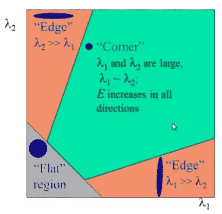
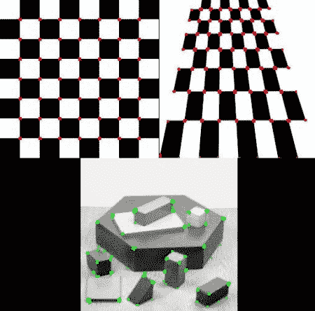
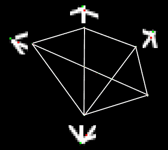

# 哈里斯角点检测

## 目标

在这一章当中，

*   我们将了解Harris Corner Detection背后的概念。
*   我们将看到函数： **[cv.cornerHarris（）](../../dd/d1a/group__imgproc__feature.html#gac1fc3598018010880e370e2f709b4345 "Harris corner detector. ")** ， **[cv.cornerSubPix（）](../../dd/d1a/group__imgproc__feature.html#ga354e0d7c86d0d9da75de9b9701a9a87e "Refines the corner locations. ")**

## 理论

在上一章中，我们看到角是图像中的区域，在所有方向上的强度变化很大。找到这些角落的早期尝试是由 **Chris Harris＆amp; amp;迈克斯蒂芬斯**在他们的论文 **1988年的联合角落和边缘探测器**，现在它被称为哈里斯角探测器。他把这个简单的想法变成了数学形式。它基本上找到了在所有方向上位移\（（u，v）\）的强度差异。这表示如下：

\ [E（u，v）= \ sum_ {x，y} \ underbrace {w（x，y）} _ \ text {window function} \，[\ underbrace {I（x + u，y + v）} _ \ text {shift intensity} - \ underbrace {I（x，y）} _ \ text {intensity}] ^ 2 \]

窗口函数是矩形窗口或高斯窗口，它为下面的像素赋予权重。

我们必须最大化此功能\（E（u，v）\）以进行角点检测。这意味着，我们必须最大化第二个任期。将Taylor Expansion应用于上述方程并使用一些数学步骤（请参考您喜欢的任何标准教科书进行完全推导），我们得到最终的等式：

\ [E（u，v）\ approx \ begin {bmatrix} u＆amp; v \ end {bmatrix} M \ begin {bmatrix} u \\ v \ end {bmatrix} \]

哪里

\ [M = \ sum_ {x，y} w（x，y）\ begin {bmatrix} I_x I_x＆amp; I_x I_y \\ I_x I_y＆amp; I_y I_y \ end {bmatrix} \]

这里，\（I_x \）和\（I_y \）分别是x和y方向的图像导数。 （可以使用 **[cv.Sobel（）](../../d4/d86/group__imgproc__filter.html#gacea54f142e81b6758cb6f375ce782c8d "Calculates the first, second, third, or mixed image derivatives using an extended Sobel operator...")** ）轻松找到。

然后是主要部分。在此之后，他们创建了一个分数，基本上是一个等式，它将确定一个窗口是否可以包含一个角落。

\ [R = det（M） - k（trace（M））^ 2 \]

where

*   \（det（M）= \ lambda_1 \ lambda_2 \）
*   \（trace（M）= \ lambda_1 + \ lambda_2 \）
*   \（\ lambda_1 \）和\（\ lambda_2 \）是M的特征值

因此，这些特征值的值决定了区域是角落，边缘还是平坦。

*   当\（| R | \）很小时，当\（\ lambda_1 \）和\（\ lambda_2 \）小时发生，该区域是平的。
*   当\（R＆lt; 0 \），当\（\ lambda_1＆gt;＆gt; \ lambda_2 \）时发生，反之亦然，该区域是边缘。
*   当\（R \）很大时，当\（\ lambda_1 \）和\（\ lambda_2 \）大而且\（\ lambda_1 \ sim \ lambda_2 \）时发生，该区域是一个角。

它可以用漂亮的图片表示如下：

image

因此，哈里斯角点检测的结果是具有这些分数的灰度图像。适合的阈值为您提供图像中的角落。我们将用一个简单的图像来完成它。

## OpenCV中的Harris角点探测器

为此，OpenCV具有 **[cv.cornerHarris（）](../../dd/d1a/group__imgproc__feature.html#gac1fc3598018010880e370e2f709b4345 "Harris corner detector. ")** 的功能。它的论点是：

*   **img** - 输入图像，应该是灰度和float32类型。
*   **blockSize** - 考虑角点检测的邻域大小
*   **ksize** - 使用的Sobel衍生物的孔径参数。
*   **k** - 方程中的Harris检测器自由参数。

请参阅以下示例：

```
import numpy as npimport cv2 as cvfilename = 'chessboard.png'img = cv.imread(filename)gray = cv.cvtColor(img,cv.COLOR_BGR2GRAY)gray = np.float32(gray)dst = cv.cornerHarris(gray,2,3,0.04)#result is dilated for marking the corners, not importantdst = cv.dilate(dst,None)# Threshold for an optimal value, it may vary depending on the image.img[dst>0.01*dst.max()]=[0,0,255]cv.imshow('dst',img)if cv.waitKey(0) & 0xff == 27: cv.destroyAllWindows()
```

以下是三个结果：

image

## 具有亚像素精度的角落

有时，您可能需要以最高精度找到角落。 OpenCV带有一个函数 **[cv.cornerSubPix（）](../../dd/d1a/group__imgproc__feature.html#ga354e0d7c86d0d9da75de9b9701a9a87e "Refines the corner locations. ")** ，它进一步细化了以亚像素精度检测到的角点。以下是一个例子。像往常一样，我们需要先找到哈里斯的角落。然后我们传递这些角的质心（角落处可能有一堆像素，我们采用它们的质心）来细化它们。哈里斯角以红色像素标记，精致角以绿色像素标记。对于此函数，我们必须定义何时停止迭代的标准。我们在经过指定次数的迭代或达到一定精度后停止它，以先发生者为准。我们还需要定义它将搜索角落的邻域大小。

```
import numpy as npimport cv2 as cvfilename = 'chessboard2.jpg'img = cv.imread(filename)gray = cv.cvtColor(img,cv.COLOR_BGR2GRAY)# find Harris cornersgray = np.float32(gray)dst = cv.cornerHarris(gray,2,3,0.04)dst = cv.dilate(dst,None)ret, dst = cv.threshold(dst,0.01*dst.max(),255,0)dst = np.uint8(dst)# find centroidsret, labels, stats, centroids = cv.connectedComponentsWithStats(dst)# define the criteria to stop and refine the cornerscriteria = (cv.TERM_CRITERIA_EPS + cv.TERM_CRITERIA_MAX_ITER, 100, 0.001)corners = cv.cornerSubPix(gray,np.float32(centroids),(5,5),(-1,-1),criteria)# Now draw themres = np.hstack((centroids,corners))res = np.int0(res)img[res[:,1],res[:,0]]=[0,0,255]img[res[:,3],res[:,2]] = [0,255,0]cv.imwrite('subpixel5.png',img)
```

下面是结果，其中一些重要位置显示在缩放窗口中以显示：

image

## 其他资源

## 演习