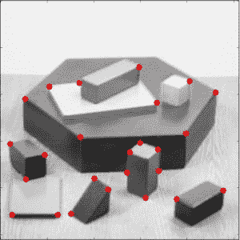

# Shi-Tomasi角落探测器＆amp;跟踪的好功能

## 目标

在这一章当中，

*   我们将了解另一个角落探测器：Shi-Tomasi角落探测器
*   我们将看到函数： **[cv.goodFeaturesToTrack（）](../../dd/d1a/group__imgproc__feature.html#ga1d6bb77486c8f92d79c8793ad995d541 "Determines strong corners on an image. ")**

## 理论

在上一章中，我们看到了Harris Corner Detector。 1994年晚些时候，J。Shi和C. Tomasi在他们的论文 **Good Features to Track** 中做了一个小修改，与Harris Corner Detector相比显示出更好的结果。 Harris角落探测器的评分功能由下式给出：

\ [R = \ lambda_1 \ lambda_2 - k（\ lambda_1 + \ lambda_2）^ 2 \]

除此之外，Shi-Tomasi提出：

\ [R = min（\ lambda_1，\ lambda_2）\]

如果它大于阈值，则将其视为拐角。如果我们像在Harris Corner Detector中那样将它绘制在\（\ lambda_1 - \ lambda_2 \）空间中，我们得到如下图像：

image

从图中可以看出，只有当\（\ lambda_1 \）和\（\ lambda_2 \）超过最小值\（\ lambda_ {min} \）时，它才被视为一个角（绿色区域）。

## 码

OpenCV有一个函数， **[cv.goodFeaturesToTrack（）](../../dd/d1a/group__imgproc__feature.html#ga1d6bb77486c8f92d79c8793ad995d541 "Determines strong corners on an image. ")** 。它通过Shi-Tomasi方法（或Harris角点检测，如果你指定它）在图像中找到N个最强角。像往常一样，图像应该是灰度图像。然后指定要查找的角点数。然后指定质量等级，该等级是0-1之间的值，表示每个人被拒绝的角落的最低质量。然后我们提供检测到的角之间的最小欧氏距离。

通过所有这些信息，该函数可以在图像中找到角点。低于质量水平的所有角落都被拒绝。然后它根据质量按降序对剩余的角进行排序。然后功能占据第一个最强的角落，抛弃最小距离范围内的所有角落并返回N个最强的角落。

在下面的例子中，我们将尝试找到25个最佳角点：

```
import numpy as npimport cv2 as cvfrom matplotlib import pyplot as pltimg = cv.imread('blox.jpg')gray = cv.cvtColor(img,cv.COLOR_BGR2GRAY)corners = cv.goodFeaturesToTrack(gray,25,0.01,10)corners = np.int0(corners)for i in corners:    x,y = i.ravel() cv.circle(img,(x,y),3,255,-1)plt.imshow(img),plt.show()
```

看下面的结果：

image

此功能更适合跟踪。我们会看到它到来的时候。

## 其他资源

## 演习