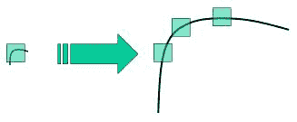
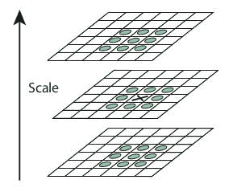

# SIFT简介（尺度不变特征变换）

## 目标

在这一章当中，

- 我们将了解SIFT算法的概念
- 我们将学习如何找到SIFT特征点和描述子。

## 理论

在前几章中，我们看到了一些角点检测器，如Harris等。它们具有旋转不变性，这意味着，即使图像旋转，我们也可以找到相同的角点。很明显，因为角点在旋转图像中也是角点。但是缩放呢？如果图像缩放，角点可能就不再是角点。以下图为例，在小图像中使用一个小窗口能够检测出角点，然而将图像放大后，在同一窗口中的图像变得平坦，无法检测出角点。所以Harris角点不是尺度不变的。



因此，在2004年，不列颠哥伦比亚大学的 **D.Lowe** 在他的论文**Distinctive Image Features from Scale-Invariant Keypoints**中提出了一种新算法，尺度不变特征变换（SIFT），用以提取特征点并计算其描述子。 *（这篇论文易于理解，被认为关于SIFT的最佳材料。以下解释只是对该论文的简短摘要）*。

SIFT算法主要涉及四个步骤。我们将逐一看到它们。

### 1.尺度空间极值检测

从上图可以看出，我们不能使用同一个窗口来检测不同尺度空间中的角点。检测小的角点可以用小的窗口，但检测更大的角点则需要更大的窗口。为此需要进行尺度空间滤波。使用不同$$\sigma$$值的高斯拉普拉斯算子（LoG）对图像进行卷积。 具有不同$$\sigma$$值的LoG可以检测不同大小的斑点。简而言之，$$\sigma$$相当于一个尺度变换因子。例如，在上图中，使用具有低$$\sigma$$的高斯核可以检测出小的角点，而具有高$$\sigma$$的高斯核则适合于检测大的角点。因此，我们可以在尺度空间和二维平面中找到局部最大值$$(x, y, \sigma)$$，这意味着在$$\sigma$$尺度中的(x,y)处有一个潜在的特征点。

但是LoG的计算量非常大，因此SIFT算法使用高斯差分，这是LoG的近似值。分别使用方差值为$$\sigma$$和$$k\sigma$$的高斯核对图像进行模糊，对所得的结果再求二者的差值就是DoG。如下图所示：

![sift_dog.jpg](img/c4ed5ae8e8eca957a15e00622f7ee089.jpg

找到DoG后，搜索不同尺度空间和二维平面中的局部最大值。例如，将图像中的一个像素与其8领域、尺度空间上一层中相邻的9个像素以及尺度空间下一层中相邻的9个像素做比较。如果它是一个局部最大值，那么它就是一个潜在的特征点。基本上可以说特征点是相应尺度空间的最佳代表。如下图所示：



对于参数的取值论文中给出了一些经验数据，可以概括为：octaves= 4，尺度等级数为 5，初始$$\sigma$$ = 1.6 ，$$k = \sqrt {2} $$作为最佳值。
### 2.关键点本地化

一旦找到潜在的关键点位置，就必须对其进行细化以获得更准确的结果。他们使用泰勒级数扩展的尺度空间来获得更准确的极值位置，并且如果此极值处的强度小于阈值（根据纸张为0.03），则将其拒绝。该阈值在OpenCV中称为 **contrastThreshold**

DoG对边缘的响应更高，因此也需要去除边缘。为此，使用类似于Harris角点检测器的概念。他们使用2x2 Hessian矩阵（H）来计算主曲率。我们从Harris角点检测器得知，对于边缘，一个特征值大于另一个。所以这里他们使用了一个简单的功能

如果此比率大于阈值，在OpenCV中称为 **edgeThreshold** ，则丢弃该关键点。它以纸张形式给出10。

因此，它消除了任何低对比度关键点和边缘关键点，剩下的是强烈的兴趣点。

### 3.定向分配

现在，为每个关键点分配方向，以实现图像旋转的不变性。根据比例在关键点位置周围进行邻域，并且在该区域中计算梯度大小和方向。创建了一个包含360度的360度的方向直方图（由梯度幅度和高斯加权圆窗加权，其中\（\ sigma \）等于关键点尺度的1.5倍）。采用直方图中的最高峰，并且还考虑任何高于其的80％的峰来计算方向。它创建具有相同位置和比例但不同方向的关键点。它有助于匹配的稳定性。

### 4.关键点描述符

现在创建了关键点描述符。在关键点周围采用16x16邻域。它分为16个4x4大小的子块。对于每个子块，创建8个bin方向直方图。因此总共有128个bin值可用。它表示为形成关键点描述符的向量。除此之外，还采取了一些措施来实现对照明变化，旋转等的鲁棒性。

### 5.关键点匹配

通过识别它们的最近邻居来匹配两个图像之间的关键点。但在某些情况下，第二个最接近的匹配可能非常接近第一个。它可能由于噪音或其他原因而发生。在那种情况下，采用最近距离与第二最近距离的比率。如果它大于0.8，则拒绝它们。根据论文，它消除了大约90％的错误匹配，而丢弃了只有5％的正确匹配。

所以这是SIFT算法的总结。有关更多详细信息和理解，强烈建议阅读原始论文。记住一件事，这个算法是专利的。所以这个算法包含在 [opencv contrib repo](https://github.com/opencv/opencv_contrib) 中

## OpenCV中的SIFT

现在让我们看看OpenCV中提供的SIFT功能。让我们从关键点检测开始并绘制它们。首先，我们必须构造一个SIFT对象。我们可以向它传递不同的参数，这些参数是可选的，它们在文档中有很好的解释。

```
import numpy as npimport cv2 as cvimg = cv.imread('home.jpg')gray= cv.cvtColor(img,cv.COLOR_BGR2GRAY)sift = cv.xfeatures2d.SIFT_create()kp = sift.detect(gray,None)img=cv.drawKeypoints(gray,kp,img)cv.imwrite('sift_keypoints.jpg',img)
```

**sift.detect（）**函数查找图像中的关键点。如果只想搜索图像的一部分，则可以传递蒙版。每个关键点都是一个特殊的结构，它有许多属性，如（x，y）坐标，有意义邻域的大小，指定方向的角度，指定关键点强度的响应等。

OpenCV还提供 **cv.drawKeyPoints（）**函数，该函数在关键点的位置上绘制小圆圈。如果您向其传递一个标志 **cv.DRAW_MATCHES_FLAGS_DRAW_RICH_KEYPOINTS** ，它将绘制一个大小为keypoint的圆圈，它甚至会显示其方向。见下面的例子。

```
img=cv.drawKeypoints(gray,kp,img,flags=cv.DRAW_MATCHES_FLAGS_DRAW_RICH_KEYPOINTS)cv.imwrite('sift_keypoints.jpg',img)
```

请参阅以下两个结果：

image

现在要计算描述符，OpenCV提供了两种方法。

1.  既然你已经找到了关键点，你可以调用 **sift.compute（）**来计算我们找到的关键点的描述符。例如：kp，des = sift.compute（灰色，kp）
2.  如果您没有找到关键点，请使用函数 **sift.detectAndCompute（）**在一个步骤中直接查找关键点和描述符。

我们将看到第二种方法：

```
sift = cv.xfeatures2d.SIFT_create()kp, des = sift.detectAndCompute(gray,None)
```

这里kp是一个关键点列表，des是一个numpy数组形状\（Number \ _of \ _ _ _ _ _ _ _ _ _ _ _ _ _ _ _ _ _ _ _ _ _ _ _ _ _ _ _ _ _ _ _ _ _ _ _ _ _ _ _ _ _ _ _

所以我们得到了关键点，描述符等。现在我们想看看如何匹配不同图像中的关键点。我们将在接下来的章节中学习。

## 其他资源

## 演习
