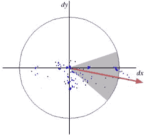
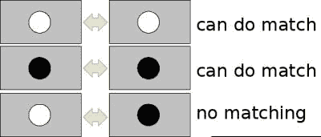

# SURF简介（加速鲁棒特性）

## 目标

在这一章当中，

*   我们将看到SURF的基础知识
*   我们将在OpenCV中看到SURF功能

## 理论

在上一章中，我们看到了SIFT的关键点检测和描述。但它相对较慢，人们需要更加快速的版本。 2006年，Bay，H.，Tuytelaars，T。和Van Gool，L三人发表了另一篇论文“SURF：Speeded Up Robust Features”，引入了一种名为SURF的新算法。顾名思义，它是SIFT的加速版本。

在SIFT中，Lowe用高斯差分近似高斯拉普拉斯算子来寻找尺度空间。 SURF更进一步，用箱式滤波器逼近LoG。下图显示了这种近似的演示。这种近似的一个很大的优点是，借助积分图像可以很容易地计算出盒式滤波器的卷积。它可以针对不同的尺度并行完成。此外，SURF依赖于Hessian矩阵的尺度和位置的行列式。

image

对于方向分配，SURF在水平和垂直方向上使用小波响应，对于大小为6s的邻域。足够的高斯权重也适用于它。然后将它们绘制在下图中给出的空间中。通过计算角度为60度的滑动定向窗口内的所有响应的总和来估计主导定向。有趣的是，小波响应可以很容易地使用积分图像找到任何规模。对于许多应用，不需要旋转不变性，因此无需找到此方向，从而加快了过程。 SURF提供称为Upright-SURF或U-SURF的功能。它可以提高速度，并且可以很强大到\（\ pm 15 ^ {\ circ} \）。 OpenCV支持两者，取决于标志，**竖立**。如果为0，则计算方向。如果为1，则不计算方向并且速度更快。

image

对于特征描述，SURF在水平和垂直方向上使用小波响应（再次，使用积分图像使事情变得更容易）。在关键点周围采用大小为20sX20s的邻域，其中s是大小。它分为4x4子区域。对于每个子区域，采用水平和垂直小波响应，并形成一个像这样的矢量，\（v =（\ sum {d_x}，\ sum {d_y}，\ sum {| d_x |}，\ sum {| d_y | }）\）。当表示为矢量时，这给出了具有总共64维的SURF特征描述符。降低尺寸，提高计算和匹配的速度，但提供更好的特征独特性。

为了更具特色，SURF特征描述符具有扩展的128维版本。 \（d_x \）和\（| d_x | \）的总和分别为\（d_y＆lt; 0 \）和\（d_y \ geq 0 \）计算。类似地，\（d_y \）和\（| d_y | \）的总和根据\（d_x \）的符号分割，从而使特征数量加倍。它不会增加太多的计算复杂性。 OpenCV支持将flag **扩展**的值分别设置为0和1分别为64-dim和128-dim（默认为128-dim）

另一个重要的改进是使用拉普拉斯算子（Hessian矩阵的迹线）作为潜在兴趣点。它不增加计算成本，因为它已经在检测期间计算出来。拉普拉斯的标志将黑暗背景上的明亮斑点与相反情况区分开来。在匹配阶段，我们只比较具有相同类型对比度的特征（如下图所示）。这种最小的信息允许更快的匹配，而不会降低描述符的性能。

image

简而言之，SURF增加了许多功能来提高每一步的速度。分析显示它比SIFT快3倍，而性能与SIFT相当。 SURF擅长处理模糊和旋转的图像，但不善于处理视点变化和光照变化。

## OpenCV中的SURF

OpenCV就像SIFT一样提供SURF功能。您使用一些可选条件（如64/128-dim描述符，Upright / Normal SURF等）启动SURF对象。所有详细信息都在文档中进行了详细说明。然后就像我们在SIFT中所做的那样，我们可以使用SURF.detect（），SURF.compute（）等来查找关键点和描述符。

首先，我们将看到一个关于如何查找SURF关键点和描述符并绘制它的简单演示。所有示例都显示在Python终端中，因为它只与SIFT相同。

```
>>> img = cv.imread('fly.png',0)# Create SURF object. You can specify params here or later.# Here I set Hessian Threshold to 400>>> surf = cv.xfeatures2d.SURF_create(400)# Find keypoints and descriptors directly>>> kp, des = surf.detectAndCompute(img,None)>>> len(kp) 699

1199个关键点太多，无法在图片中显示。我们将它减少到大约50以将其绘制在图像上。在匹配时，我们可能需要所有这些功能，但现在不需要。所以我们增加了Hessian阈值。

# Check present Hessian threshold
>>> [print](../../df/d57/namespacecv_1_1dnn.html#a701210a0203f2786cbfd04b2bd56da47)( surf.getHessianThreshold() )
400.0
# We set it to some 50000\. Remember, it is just for representing in picture.
# In actual cases, it is better to have a value 300-500
>>> surf.setHessianThreshold(50000)

# Again compute keypoints and check its number.
>>> kp, des = surf.detectAndCompute(img,None)

>>> [print](../../df/d57/namespacecv_1_1dnn.html#a701210a0203f2786cbfd04b2bd56da47)( len(kp) )
47

它小于50.让我们在图像上绘制它。

>>> img2 = [cv.drawKeypoints](../../d4/d5d/group__features2d__draw.html#ga5d2bafe8c1c45289bc3403a40fb88920)(img,kp,None,(255,0,0),4)
>>> plt.imshow(img2),plt.show()

请参阅下面的结果。你可以看到SURF更像是斑点探测器。它检测到蝴蝶翅膀上的白色斑点。您可以使用其他图像进行测试。


image

现在我想申请U-SURF，以便找不到方向。

```
# Check upright flag, if it False, set it to True>>> print( surf.getUpright() )False>>> surf.setUpright(True)# Recompute the feature points and draw it>>> kp = surf.detect(img,None)>>> img2 = cv.drawKeypoints(img,kp,None,(255,0,0),4)>>> plt.imshow(img2),plt.show()
```

请参阅下面的结果。所有方向都以相同的方向显示。它比以前更快。如果您正在研究方向不是问题的情况（如全景拼接）等，那就更好了。


image

最后，我们检查描述符大小，如果它只有64-dim，则将其更改为128。

```
# Find size of descriptor>>> print( surf.descriptorSize() )64# That means flag, "extended" is False.>>> surf.getExtended() False# So we make it to True to get 128-dim descriptors.>>> surf.setExtended(True)>>> kp, des = surf.detectAndCompute(img,None)>>> print( surf.descriptorSize() )128>>> print( des.shape )(47, 128)
```

剩下的部分是匹配，我们将在另一章中做。

## 其他资源

## 演习

```