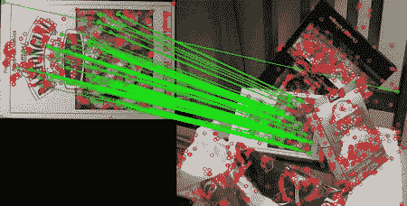

# 特征匹配

## 目标

在这一章当中

*   我们将看到如何将一个图像中的要素与其他图像进行匹配。
*   我们将在OpenCV中使用Brute-Force匹配器和FLANN Matcher

## 蛮力匹配的基础知识

蛮力匹配器很简单。它采用第一组中的一个特征的描述符，并使用一些距离计算与第二组中的所有其他特征匹配。并返回最接近的一个。

对于BF匹配器，首先我们必须使用 **[cv.BFMatcher（）](../../d3/da1/classcv_1_1BFMatcher.html "Brute-force descriptor matcher. ")** 创建BFMatcher对象。它需要两个可选的参数。第一个是normType。它指定要使用的距离测量。默认情况下，它是 [cv.NORM_L2](../../d2/de8/group__core__array.html#ggad12cefbcb5291cf958a85b4b67b6149fa7bacbe84d400336a8f26297d8e80e3a2) 。它对SIFT，SURF等有好处（ [cv.NORM_L1](../../d2/de8/group__core__array.html#ggad12cefbcb5291cf958a85b4b67b6149fab55c78ff204a979026c026ea19de65c9) 也在那里）。对于基于二进制字符串的描述符，如ORB，BRIEF，BRISK等，应使用 [cv.NORM_HAMMING](../../d2/de8/group__core__array.html#ggad12cefbcb5291cf958a85b4b67b6149fa4b063afd04aebb8dd07085a1207da727) ，它使用汉明距离作为度量。如果ORB使用WTA_K == 3或4，则应使用 [cv.NORM_HAMMING2](../../d2/de8/group__core__array.html#ggad12cefbcb5291cf958a85b4b67b6149fa7fab9cda83e79380cd273c49de8e3231) 。

第二个参数是布尔变量，crossCheck默认为false。如果为真，则Matcher仅返回具有值（i，j）的匹配，使得集合A中的第i个描述符具有集合B中的第j个描述符作为最佳匹配，反之亦然。也就是说，两组中的两个特征应该相互匹配。它提供了一致的结果，是D.Lowe在SIFT论文中提出的比率测试的一个很好的替代方案。

一旦创建，两个重要的方法是 _BFMatcher.match（）_和 _BFMatcher.knnMatch（）_。第一个返回最佳匹配。第二种方法返回k个最佳匹配，其中k由用户指定。当我们需要做更多的工作时，它可能会有用。

就像我们使用 [cv.drawKeypoints（）](../../d4/d5d/group__features2d__draw.html#ga5d2bafe8c1c45289bc3403a40fb88920 "Draws keypoints. ")绘制关键点一样， **[cv.drawMatches（）](../../d4/d5d/group__features2d__draw.html#gad8f463ccaf0dc6f61083abd8717c261a "Draws the found matches of keypoints from two images. ")** 帮助我们绘制匹配。它水平堆叠两个图像，并从第一个图像到第二个图像绘制线条，显示最佳匹配。还有 **cv.drawMatchesKnn** ，它绘制了所有k个最佳匹配。如果k = 2，它将为每个关键点绘制两条匹配线。因此，如果我们想要有选择地绘制它，我们必须传递一个掩码。

让我们看一下SURF和ORB的两个例子（两者都使用不同的距离测量）。

### 与ORB描述符的强力匹配

在这里，我们将看到一个关于如何匹配两个图像之间的特征的简单示例。在这种情况下，我有一个queryImage和一个trainImage。我们将尝试使用特征匹配在trainImage中查找queryImage。 （图片为/samples/c/box.png和/samples/c/box_in_scene.png）

我们使用ORB描述符来匹配功能。所以让我们从加载图像，查找描述符等开始。

```
import numpy as npimport cv2 as cvimport matplotlib.pyplot as pltimg1 = cv.imread('box.png',0)          # queryImageimg2 = cv.imread('box_in_scene.png',0) # trainImage# Initiate ORB detectororb = cv.ORB_create()# find the keypoints and descriptors with ORBkp1, des1 = orb.detectAndCompute(img1,None)kp2, des2 = orb.detectAndCompute(img2,None)

接下来，我们使用距离测量创建一个BFMatcher对象 [cv.NORM_HAMMING](../../d2/de8/group__core__array.html#ggad12cefbcb5291cf958a85b4b67b6149fa4b063afd04aebb8dd07085a1207da727) （因为我们使用的是ORB）并且启用了crossCheck以获得更好的结果。然后我们使用Matcher.match（）方法在两个图像中获得最佳匹配。我们按照距离的升序对它们进行排序，以便最佳匹配（低距离）出现在前面。然后我们只画出前10场比赛（仅为了能见度。你可以随意增加）

# create BFMatcher object
bf = [cv.BFMatcher](../../d3/da1/classcv_1_1BFMatcher.html)(cv.NORM_HAMMING, crossCheck=True)
# Match descriptors.
matches = bf.match(des1,des2)

# Sort them in the order of their distance.
matches = sorted(matches, key = lambda x:x.distance)

# Draw first 10 matches.
img3 = [cv.drawMatches](../../d4/d5d/group__features2d__draw.html#ga62fbedb5206ab2faf411797e7055c90f)(img1,kp1,img2,kp2,matches[:10], flags=2)

plt.imshow(img3),plt.show()

以下是我得到的结果：


image

### 这个Matcher对象是什么？

matches = bf.match（des1，des2）行的结果是DMatch对象的列表。此DMatch对象具有以下属性：

*   DMatch.distance  - 描述符之间的距离。越低越好。

*   DMatch.trainIdx  - 列车描述符中描述符的索引

*   DMatch.queryIdx  - 查询描述符中描述符的索引

*   DMatch.imgIdx  - 火车图像的索引。

### 与SIFT描述符和比率测试的强力匹配

这一次，我们将使用BFMatcher.knnMatch（）来获得最佳匹配。在这个例子中，我们将采用k = 2，以便我们可以在他的论文中应用D.Lowe解释的比率测试。

```
import numpy as npimport cv2 as cvfrom matplotlib import pyplot as pltimg1 = cv.imread('box.png',0)          # queryImageimg2 = cv.imread('box_in_scene.png',0) # trainImage# Initiate SIFT detectorsift = cv.SIFT()# find the keypoints and descriptors with SIFTkp1, des1 = sift.detectAndCompute(img1,None)kp2, des2 = sift.detectAndCompute(img2,None)# BFMatcher with default paramsbf = cv.BFMatcher()matches = bf.knnMatch(des1,des2, k=2)# Apply ratio testgood = []for m,n in matches: if m.distance < 0.75*n.distance:        good.append([m])# cv.drawMatchesKnn expects list of lists as matches.img3 = cv.drawMatchesKnn(img1,kp1,img2,kp2,good,flags=2)plt.imshow(img3),plt.show()
```

看下面的结果：


image

## 基于FLANN的Matcher

FLANN代表近似最近邻居的快速图书馆。它包含一系列算法，这些算法针对大型数据集中的快速最近邻搜索和高维特征进行了优化。对于大型数据集，它比BFMatcher工作得更快。我们将看到基于FLANN的匹配器的第二个示例。

对于基于FLANN的匹配器，我们需要传递两个字典，指定要使用的算法，其相关参数等。首先是IndexParams。对于各种算法，要传递的信息在FLANN文档中进行了解释。总而言之，对于像SIFT，SURF等算法，您可以传递以下内容：

```
FLANN_INDEX_KDTREE = 1index_params = dict(algorithm = FLANN_INDEX_KDTREE, trees = 5)

使用ORB时，您可以传递以下内容。根据文档推荐使用注释值，但在某些情况下不会提供所需的结果。其他价值很好：

FLANN_INDEX_LSH = 6
index_params= dict(algorithm = FLANN_INDEX_LSH,
                   table_number = 6, # 12
                   key_size = 12,     # 20
                   multi_probe_level = 1) #2

第二个字典是SearchParams。它指定应递归遍历索引中的树的次数。值越高，精度越高，但也需要更多时间。如果要更改该值，请传递search_params = dict（checks = 100）。

有了这些信息，我们很高兴。

```
import numpy as npimport cv2 as cvfrom matplotlib import pyplot as pltimg1 = cv.imread('box.png',0)          # queryImageimg2 = cv.imread('box_in_scene.png',0) # trainImage# Initiate SIFT detectorsift = cv.SIFT()# find the keypoints and descriptors with SIFTkp1, des1 = sift.detectAndCompute(img1,None)kp2, des2 = sift.detectAndCompute(img2,None)# FLANN parametersFLANN_INDEX_KDTREE = 1index_params = dict(algorithm = FLANN_INDEX_KDTREE, trees = 5)search_params = dict(checks=50)   # or pass empty dictionaryflann = cv.FlannBasedMatcher(index_params,search_params)matches = flann.knnMatch(des1,des2,k=2)# Need to draw only good matches, so create a maskmatchesMask = [[0,0] for i in xrange(len(matches))]# ratio test as per Lowe's paperfor i,(m,n) in enumerate(matches): if m.distance < 0.7*n.distance:        matchesMask[i]=[1,0]draw_params = dict(matchColor = (0,255,0),                   singlePointColor = (255,0,0),                   matchesMask = matchesMask,                   flags = 0)img3 = cv.drawMatchesKnn(img1,kp1,img2,kp2,matches,None,**draw_params)plt.imshow(img3,),plt.show()
```

 See the result below:



image

## 其他资源

## 演习

```

```