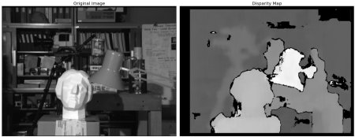

# 立体图像的深度图

## 目标

在本章节中，

- 我们将学习到如何通过立体图像来创建深度图。

## 基础

在上一章节中，我们看到了一些基本概念像是线性约束和其他相关术语。我们同时也看到，如果我们有两个相同场景的图像，我们便可以直观的获取到其深度信息。下面便是一张图片和一些用以证明这种直观现象的数学公式(图片提供：(译者注：这里原文中就没写出处)


<center>stereo depth image</center>

上图包含等边三角形。写出其等效方程则如下：
$$
{\notag}
disparity = x - x' = \frac{Bf}{Z}
$$
$$x$$和$$x'$$是图像平面上的点对应的3D场景点与相机投影中心之间的距离。$$B$$是两个摄像机之间的距离(这是我们知道的)，$$F$$是相机的焦距(早已知晓)。所以长话短说，上面的等式便是说一个场景点的深度是与相应图像点及其相机投影中心的距离差成反比的。所以通过这个信息，我们边可以推导出图像中所有像素的深度。

所以它将在两个图象之间进行匹配。我们已经看到过如何使用线性约束使这个操作更快更准确。一旦寻找到匹配点，我们便可以找到其视差。让我们看看我们如何使用OpenCV来实现它。

## 代码

下面的代码片段展示了创建视差图的简单过程。

```python
import numpy as np
import cv2 as cv
from matplotlib import pyplot as plt

imgL = cv.imread('tsukuba_l.png',0)
imgR = cv.imread('tsukuba_r.png',0)

stereo = cv.StereoBM_create(numDisparities=16, blockSize=15)
disparity = stereo.compute(imgL,imgR)
plt.imshow(disparity,'gray')
plt.show()
```

下面的图像包含有原图像(左)和视差图(右)。正如你看到的，结果被高度的噪声所污染。通过调整numDisparities和blockSize的值，你可以获得更好的结果。



<center>disparity map image</center>


参数：

- texture_threshold: 
- Speckle range and size: 
- Number of disparities: 
- min_disparity: 
- uniqueness_ratio: 
- prefilter_size and prefilter_cap: 

## 其他资源

- [旋转立体图像处理的维基百科页面](https://wiki.ros.org/stereo_image_proc/Tutorials/ChoosingGoodStereoParameters)

## 练习

1. OpenCV实例中包含有一个关于