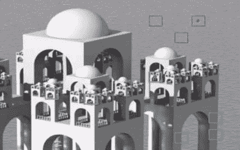
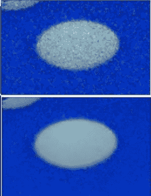
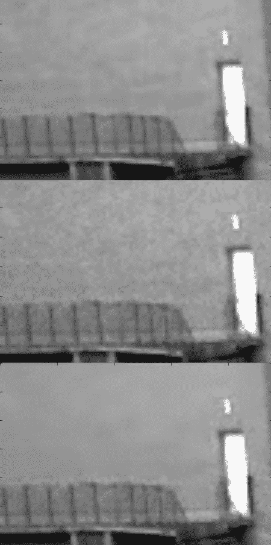

# 图像去噪

## 目标

在这一章当中，

*   您将了解非局部均值去噪算法以消除图像中的噪声。
*   你会看到不同的功能，如 **[cv.fastNlMeansDenoising（）](../../d1/d79/group__photo__denoise.html#ga4c6b0031f56ea3f98f768881279ffe93 "Perform image denoising using Non-local Means Denoising algorithm http://www.ipol.im/pub/algo/bcm_non_local_means_denoising/ with several computational optimizations. Noise expected to be a gaussian white noise. ")** ， **[cv.fastNlMeansDenoisingColored（）](../../d1/d79/group__photo__denoise.html#ga03aa4189fc3e31dafd638d90de335617 "Modification of fastNlMeansDenoising function for colored images. ")** 等。

## 理论

在前面的章节中，我们已经看到许多图像平滑技术，如高斯模糊，中位模糊等，它们在一定程度上消除了少量噪声。在这些技术中，我们在像素周围采用了一个小邻域，并进行了一些操作，如高斯加权平均值，值的中值等，以替换中心元素。简而言之，像素处的噪声消除是其邻域的局部。

有噪音的财产。噪声通常被认为是零均值的随机变量。考虑一个有噪声的像素，$( p = p_0 + n )$ 其中 $( p_0 )$ 是像素的真值，$( n )$  是该像素中的噪声。您可以从不同的图像中获取大量相同的像素例如 $( N ) $ 并计算它们的平均值。理想情况下，你应该得到 $( p = p_0 )$，因为噪声的平均值为零。

您可以通过简单的设置自行验证。将静态相机固定在某个位置几秒钟。这将为您提供大量的帧或同一场景的大量图像。然后写一段代码来查找视频中所有帧的平均值（这对你来说应该太简单了）。比较最终结果和第一帧。你可以看到减少噪音。不幸的是，这种简单的方法对相机和场景运动不稳健。通常也只有一个嘈杂的图像。

所以想法很简单，我们需要一组类似的图像来平均噪音。考虑图像中的一个小窗口（比如5x5窗口）。机会很大，相同的补丁可能在图像中的其他位置。有时在它附近的一个小社区。如何一起使用这些类似的补丁并找到它们的平均值？对于那个特定的窗口，那很好。请参阅下面的示例图片：



图像中的蓝色斑块看起来很相似。绿色斑块看起来相似。所以我们拍摄一个像素，在它周围采取小窗口，在图像中搜索类似的窗口，平均所有窗口并用我们得到的结果替换像素。该方法是非局部均值去噪。与我们之前看到的模糊技术相比，它需要更多的时间，但结果非常好。更多详细信息和在线演示可以在其他资源的第一个链接中找到。

对于彩色图像，图像被转换为​​CIELAB色彩空间，然后单独对L和AB分量进行去噪。

## OpenCV中的图像去噪

OpenCV提供了这种技术的四种变体。

1.  **[cv.fastNlMeansDenoising（）](../../d1/d79/group__photo__denoise.html#ga4c6b0031f56ea3f98f768881279ffe93 "Perform image denoising using Non-local Means Denoising algorithm http://www.ipol.im/pub/algo/bcm_non_local_means_denoising/ with several computational optimizations. Noise expected to be a gaussian white noise. ")** - 适用于单个灰度图像
2.  **[cv.fastNlMeansDenoisingColored（）](../../d1/d79/group__photo__denoise.html#ga03aa4189fc3e31dafd638d90de335617 "Modification of fastNlMeansDenoising function for colored images. ")** - 适用于彩色图像。
3.  **[cv.fastNlMeansDenoisingMulti（）](../../d1/d79/group__photo__denoise.html#gaf4421bf068c4d632ea7f0aa38e0bf172 "Modification of fastNlMeansDenoising function for images sequence where consecutive images have been ...")** - 适用于短时间内拍摄的图像序列（灰度图像）
4.  **[cv.fastNlMeansDenoisingColoredMulti（）](../../d1/d79/group__photo__denoise.html#gaa501e71f52fb2dc17ff8ca5e7d2d3619 "Modification of fastNlMeansDenoisingMulti function for colored images sequences. ")** - 与上述相同，但适用于彩色图像。

常见的论点是：

*   h：参数决定滤波器强度。较高的h值可以更好地消除噪声，但也会删除图像的细节。 （10个没问题）
*   hForColorComponents：与h相同，但仅适用于彩色图像。 （通常与h相同）
*   templateWindowSize：应该是奇数。 （推荐7）
*   searchWindowSize：应该是奇数。 （推荐21）

有关这些参数的详细信息，请访问其他资源中的第一个链接。

我们将在这里演示2和3。休息留给你。

### 1\. [cv.fastNlMeansDenoisingColored（）](../../d1/d79/group__photo__denoise.html#ga03aa4189fc3e31dafd638d90de335617 "Modification of fastNlMeansDenoising function for colored images. ")

如上所述，它用于从彩色图像中去除噪声。 （噪音预计是高斯噪音）。请参阅以下示例：

```
import numpy as np
import cv2 as cv
from matplotlib import pyplot as plt
img = cv.imread('die.png')

dst=cv.fastNlMeansDenoisingColored(img,None,10,10,7,21)

plt.subplot(121),plt.imshow(img)
plt.subplot(122),plt.imshow(dst)
plt.show()
```

下面是结果的缩放版本。我的输入图像的高斯噪声为　$( sigma = 25)$。看结果：



### 2\. [cv.fastNlMeansDenoisingMulti（）](../../d1/d79/group__photo__denoise.html#gaf4421bf068c4d632ea7f0aa38e0bf172 "Modification of fastNlMeansDenoising function for images sequence where consecutive images have been ...")

现在我们将相同的方法应用于视频。第一个参数是嘈杂帧的列表。第二个参数imgToDenoiseIndex指定我们需要去噪的帧，因为我们在输入列表中传递了frame的索引。第三个是temporalWindowSize，它指定了用于去噪的附近帧的数量。应该很奇怪。在这种情况下，使用总共temporalWindowSize帧，其中中心帧是要去噪的帧。例如，您传递了5个帧的列表作为输入。设imgToDenoiseIndex = 2和temporalWindowSize = 3.然后使用frame-1，frame-2和frame-3对帧-2进行去噪。我们来看一个例子吧。

```
import numpy as np
import cv2 as cv
from matplotlib import pyplot as plt

cap = cv.VideoCapture('vtest.avi')
# create a list of first 5 frames
img = [cap.read()[1] for i in xrange(5)]

# convert all to grayscale
gray = [cv.cvtColor(i, cv.COLOR_BGR2GRAY) for i in img]

# convert all to float64
gray = [np.float64(i) for i in gray]

# create a noise of variance 25
noise = np.random.randn(*gray[1].shape)*10

# Add this noise to images
noisy = [i+noise for i in gray]

# Convert back to uint8
noisy = [np.uint8(np.clip(i,0,255)) for i in noisy]

# Denoise 3rd frame considering all the 5 frames

dst = cv.fastNlMeansDenoisingMulti(noisy, 2, 5, None, 4, 7,35)

plt.subplot(131),plt.imshow(gray[2],'gray')
plt.subplot(132),plt.imshow(noisy[2],'gray')
plt.subplot(133),plt.imshow(dst,'gray')
plt.show()
```

下图显示了我们得到的结果的缩放版本：



计算需要相当长的时间。在结果中，第一图像是原始帧，第二图像是噪声图像，第三图像是去噪图像。

## 其他资源

1.  [http://www.ipol.im/pub/art/2011/bcm_nlm/](http://www.ipol.im/pub/art/2011/bcm_nlm/) （它有详细信息，在线演示等。强烈建议访问。我们的测试图像是从这个链接生成的）
2.  [coursera](https://www.coursera.org/courimg) 的在线课程（第一张图片来自这里）

## 演习